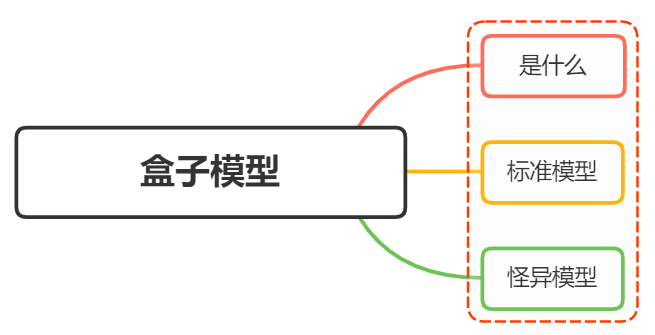
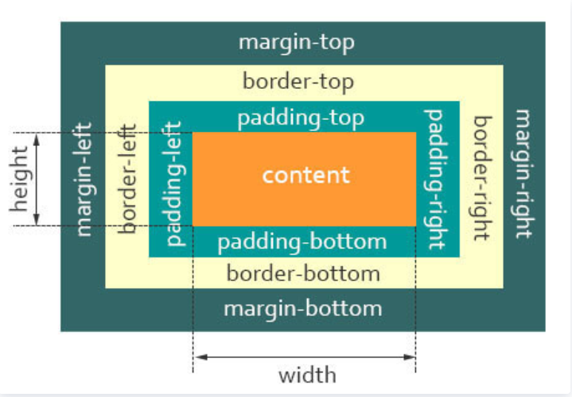

## 1.1 什么是盒模型？

当对一个文档进行布局（layout）的时候，浏览器的渲染引擎会根据标准之一的 CSS 基础框盒模型（CSS basic box model），将所有元素表示为一个个矩形的盒子（box）
一个盒子由四个部分组成：content、padding、border、margin。


- content，即实际内容，显示文本和图像

- boreder，即边框，围绕元素内容的内边距的一条或多条线，由粗细、样式、颜色三部分组成

- padding，即内边距，清除内容周围的区域，内边距是透明的，取值不能为负，受盒子的 background 属性影响

- margin，即外边距，在元素外创建额外的空白，空白通常指不能放其他元素的区域

## 1.2 标准盒模型

标准盒子模型，是浏览器默认的盒子模型。

- **盒子总宽度** = width + padding + border + margin;

- **盒子总高度** = height + padding + border + margin;

注意：width/height 只是内容高度，不包含 padding 和 border 值。

## 1.3 怪异盒模型

在怪异模式下，盒子的总宽度和高度是包含内边距 padding 和边框 border 宽度在内的。

- **盒子总宽度** = width + margin = 内容区宽度 + padding + border + margin;

- **盒子总高度** = height + margin = 内容区高度 + padding + border + margin;

## 1.4 Box-sizing

CSS 中的 box-sizing 属性定义了引擎应该如何计算一个元素的总宽度和总高度

语法：

```css
box-sizing: content-box|border-box|inherit;
```
- content-box 默认值，元素的 width/height 不包含padding，border，与标准盒子模型表现一致
- border-box 元素的 width/height 包含 padding，border，与怪异盒子模型表现一致
- inherit 指定 box-sizing 属性的值，应该从父元素继承


